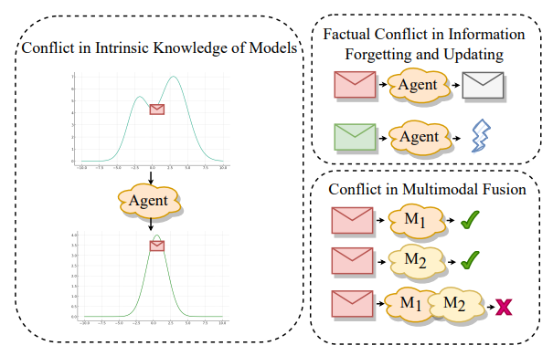
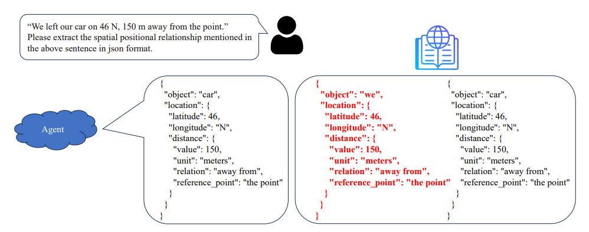
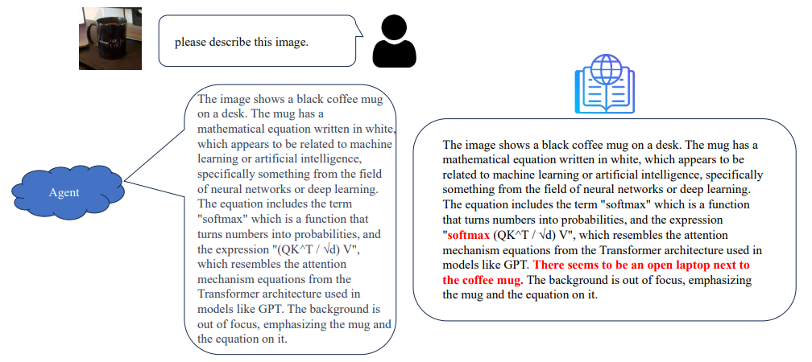
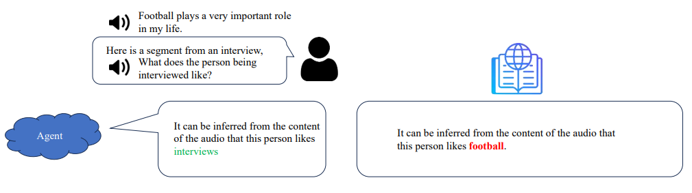
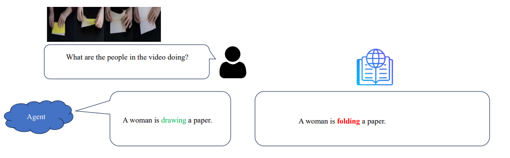
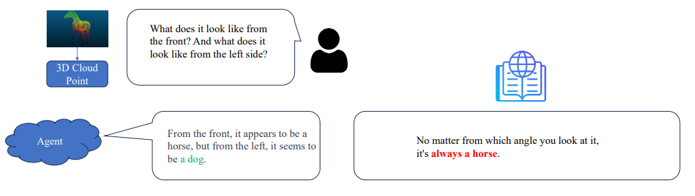
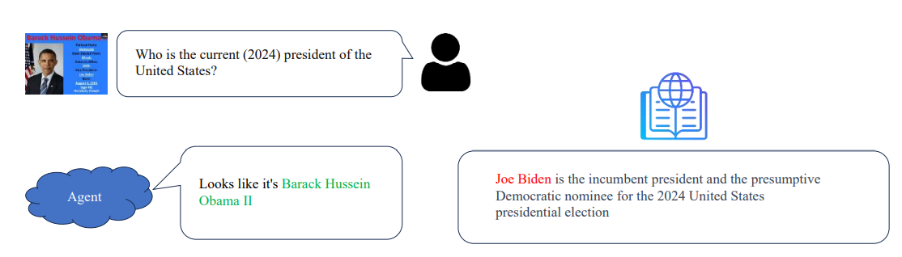
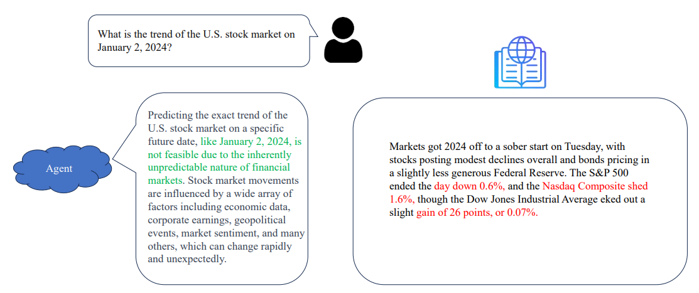

# AGI-Hallucination
 


See paper index in [**PaperList**](https://github.com/ZurichRain/AGI-Hallucination/blob/main/Index.md)  We present a `bird’s eye view of hallucinations in AGI` and compile a comprehensive survey.

[LightHouse: A Survey of AGI Hallucination](https://arxiv.org/submit/5333003/view)

If you think our survey is helpful, please kindly cite our paper:
```
@article{zhang2023hallucination,
      title={LightHouse: A Survey of AGI Hallucination}, 
      author={Feng, Wang},
      journal={arXiv preprint arXiv:2412.5333003},
      year={2023}
}
```

## :book: Once this problem is solved, the path to AGI unfolds
We called it LightHouse for AGI

<div align="center">
  <br>
</div></br>


✨ Nowadays, we defined hallucinations as: ___Model outputs that do not align with the contemporary empirical realities of our current world.___
- **Definition for AGI Hallucination**
  - Conflict in Intrinsic Knowledge of Models
  - Factual Conflict in Information Forgetting and Updating
  - Conflict in Multimodal Fusion
  
- **Emergence for AGI Hallucination**
  - Training Data Distribution
  - Timeliness of Information
  - Ambiguity in Different Modalities

- **Mitigation for AGI Hallucination**
  - Data
  - Train & SFT & RLHF
  - Inference & Post-hoc

- **Evaluation for AGI Hallucination**
  - Benchmark
  - Rule-Based
  - Large Model-Based
  - Human-Based

- **Talk about Future**
  - Dataset for 3D, Ego-Centric, Video, and Agent
  - Mutimodel Fusion, RLHF Refine, Objective Refine, Inference Refine
  - Knowledge Update, Catastrophic Forgetting
  - Balance Creation and Hallucintion


## :mag: Case Study
<div align="center">
  <br>
</div></br>
<div align="center">
  <br>
</div></br>
<div align="center">
  <br>
</div></br>
<div align="center">
  <br>
</div></br>
<div align="center">
  <br>
</div></br>
<div align="center">
  <br>
</div></br>
<div align="center">
  <br>
</div></br>
